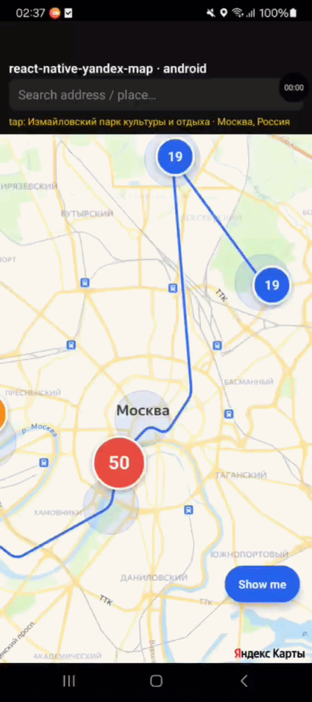
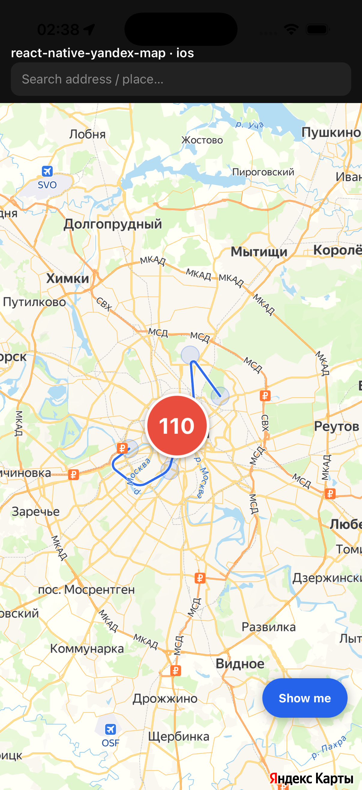
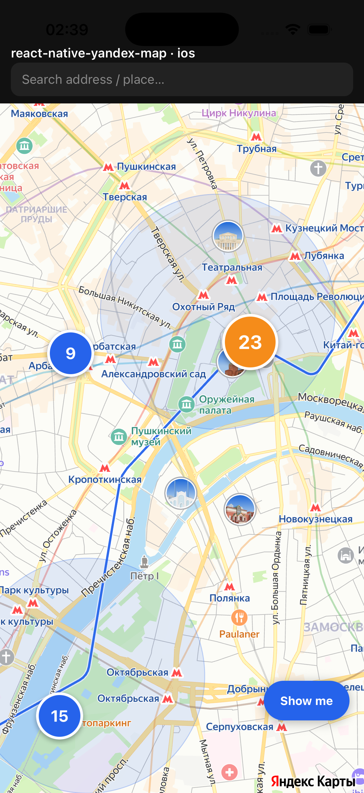
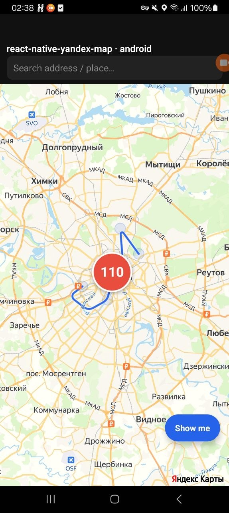
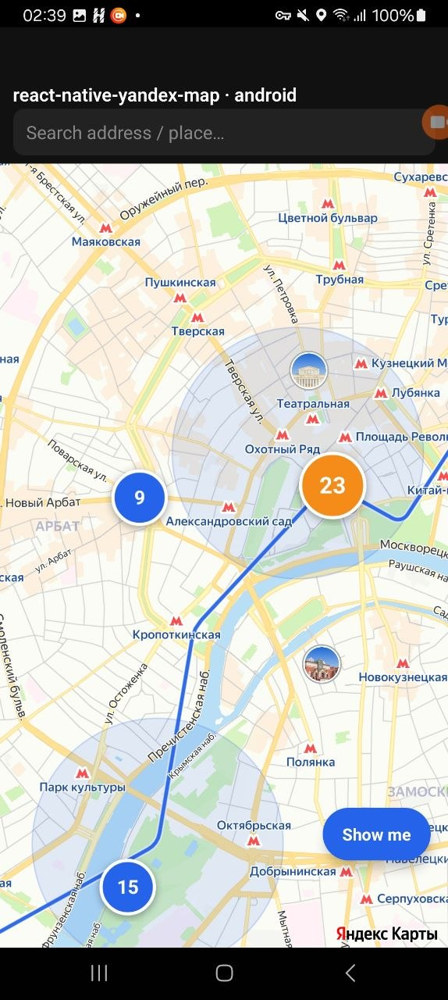

# react-native-yandex-map

React Native Fabric binding for Yandex MapKit Mobile SDK (New Architecture).

Native map view, markers with React-rendered content, polylines / polygons / circles,
clustered placemarks, search / suggest / reverse geocode, and user location — all wired
through Fabric ViewComponents and TurboModules on RN 0.85+.

<p align="center">
  
</p>

<table>
  <tr>
    <td></td>
    <td></td>
    <td></td>
    <td></td>
  </tr>
</table>

## Requirements

- React Native **0.85+** with the **New Architecture** enabled (Fabric + TurboModules)
- React **19+**
- iOS **13+**
- Android **API 26+** (Android 8.0)
- A Yandex MapKit Mobile **API key** — get one at <https://developer.tech.yandex.ru/>

## Installation

```sh
yarn add react-native-yandex-map
# or
npm install react-native-yandex-map
```

### iOS

```sh
cd ios && pod install
```

Add your API key to `ios/<App>/Info.plist`:

```xml
<key>YandexMapKitApiKey</key>
<string>YOUR-API-KEY-HERE</string>
```

…or call `YandexMap.init('YOUR-API-KEY-HERE')` once on app startup.

### Android

Add your API key as a `<meta-data>` entry inside `<application>` in
`android/app/src/main/AndroidManifest.xml`:

```xml
<meta-data
  android:name="com.yandex.maps.ApiKey"
  android:value="YOUR-API-KEY-HERE" />
```

…or call `YandexMap.init('YOUR-API-KEY-HERE')` once on app startup.

Location permissions, if you need the user-position layer:

```xml
<uses-permission android:name="android.permission.ACCESS_FINE_LOCATION" />
<uses-permission android:name="android.permission.ACCESS_COARSE_LOCATION" />
```

## Quick start

```tsx
import {
  YandexMapView,
  Marker,
  type YandexMapRef,
} from 'react-native-yandex-map';
import { useRef } from 'react';

export default function App() {
  const mapRef = useRef<YandexMapRef>(null);
  return (
    <YandexMapView
      ref={mapRef}
      style={{ flex: 1 }}
      initialRegion={{ lat: 55.751244, lon: 37.618423, zoom: 12 }}
      onMapPress={(p) => console.log('tap', p)}>
      <Marker point={{ lat: 55.7539, lon: 37.6208 }} />
    </YandexMapView>
  );
}
```

## Components

### `<YandexMapView>`

Native map container. Renders children (Marker, Polyline, Polygon, Circle,
ClusteredMarkers) as map objects.

**Props**

| Prop | Type | Description |
| --- | --- | --- |
| `initialRegion` | `{ lat, lon, zoom, azimuth?, tilt? }` | Initial camera position |
| `showUserPosition` | `boolean` | Show user location layer (needs permission) |
| `nightMode` | `boolean` | Dark style |
| `mapStyle` | `string` | JSON style override |
| `scrollGesturesEnabled` | `boolean` | |
| `zoomGesturesEnabled` | `boolean` | |
| `tiltGesturesEnabled` | `boolean` | |
| `rotateGesturesEnabled` | `boolean` | |
| `fastTapEnabled` | `boolean` | Skip the dbl-tap-to-zoom delay on `onMapPress` |
| `onMapPress` | `(point) => void` | |
| `onMapLongPress` | `(point) => void` | |
| `onMapLoaded` | `(event) => void` | |
| `onCameraPositionChange` | `(pos) => void` | Fires while gesture is in flight |
| `onCameraPositionChangeEnd` | `(pos) => void` | Fires after gesture settles |

**Imperative ref**

| Method | Description |
| --- | --- |
| `setCenter(point, options?)` | Animate camera to point |
| `setZoom(zoom, options?)` | Animate zoom |
| `fitMarkers(points[])` | Animate camera to fit a bounding box |
| `setTrafficVisible(visible)` | Toggle the traffic overlay |

### `<Marker>`

Single placemark. Supports either a bitmap `source` or **React children**:
children are laid out offscreen and snapshotted to a bitmap on every prop
change, which means any React component (text labels, callouts, animated dots)
can be used as the placemark icon.

```tsx
<Marker
  point={{ lat: 55.75, lon: 37.62 }}
  source={require('./pin.png')}
  anchor={{ x: 0.5, y: 1 }}   // bottom-center
  scale={1.5}
/>

<Marker point={{ lat: 55.75, lon: 37.62 }} style={{ width: 120, height: 48 }}>
  <View style={callout}>
    <Text>Custom React label</Text>
  </View>
</Marker>
```

When using `children`, the Marker MUST have explicit `style={{ width, height }}` —
Fabric Yoga does not auto-size markers based on intrinsic content.

### `<Polyline>`, `<Polygon>`, `<Circle>`

Vector shapes. All accept `strokeColor`, `strokeWidth`, optional `fillColor`
(for Polygon / Circle), and `placemarkZIndex`.

```tsx
<Polyline points={[a, b, c]} strokeColor="#2563eb" strokeWidth={4} />
<Polygon points={[a, b, c, a]} strokeColor="#2563eb" fillColor="rgba(37,99,235,0.2)" />
<Circle center={{ lat, lon }} radius={500} strokeColor="#2563eb" fillColor="rgba(37,99,235,0.2)" />
```

### `<ClusteredMarkers>`

A clusterized placemark collection. Pass an array of `points` and optionally
per-point `pointLabels`; native renders a pill bitmap per unique label and
caches them, so 1000 placemarks with ~50 unique labels still use ~50 bitmaps.

```tsx
<ClusteredMarkers
  points={[{ lat, lon }, ...]}
  pointLabels={['Кремль', 'ВДНХ', ...]}
  clusterRadius={150}
  clusterMinZoom={16}
  onClusterPress={({ bounds }) => mapRef.current?.fitMarkers([bounds.southWest, bounds.northEast])}
/>
```

The default cluster style is **count-aware**: bigger and warmer-coloured for
denser clusters. Override with `clusterColor` / `clusterTextColor` if you want
a flat palette.

## Search

```ts
import { Search, Suggest } from 'react-native-yandex-map';

// Address autocomplete — biases ranking toward `userPosition` without
// hard-filtering. Wide bbox is fine.
const items = await Suggest.suggest('Большой театр', RUSSIA_BBOX, {
  userPosition: { lat: 55.75, lon: 37.62 },
});

// Resolve a suggestion URI directly to a single hit. ALWAYS use this for
// pick-suggestion handlers — re-running `searchByText` with free text can
// drift to a different city.
const hit = await Search.resolveUri(items[0].uri);

// Reverse geocode
const place = await Search.geocodePoint({ lat: 55.75, lon: 37.62 });
```

## Locale

```ts
await YandexMap.setLocale('ru_RU'); // affects map labels + search results
```

## User location

```ts
const status = await YandexMap.requestLocationPermission();
if (status === 'granted') {
  const me = await YandexMap.getCurrentLocation();
  mapRef.current?.setCenter(me, { zoom: 15 });
}
```

## Known limitations

- **Fabric / New Architecture only.** No Paper bridge fallback.
- iOS map locale APIs require MapKit to be initialised first; `setLocale` works
  whenever called, but for the cleanest result call it before mounting the
  first `<YandexMapView>`.
- The `mapStyle` JSON format is the same as Yandex web maps — see Yandex docs
  for full schema.

## Contributing

- [Development workflow](CONTRIBUTING.md#development-workflow)
- [Sending a pull request](CONTRIBUTING.md#sending-a-pull-request)

## License

MIT
